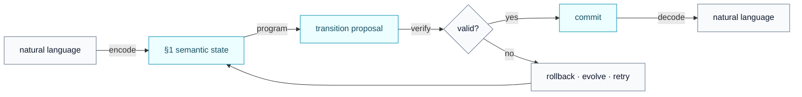
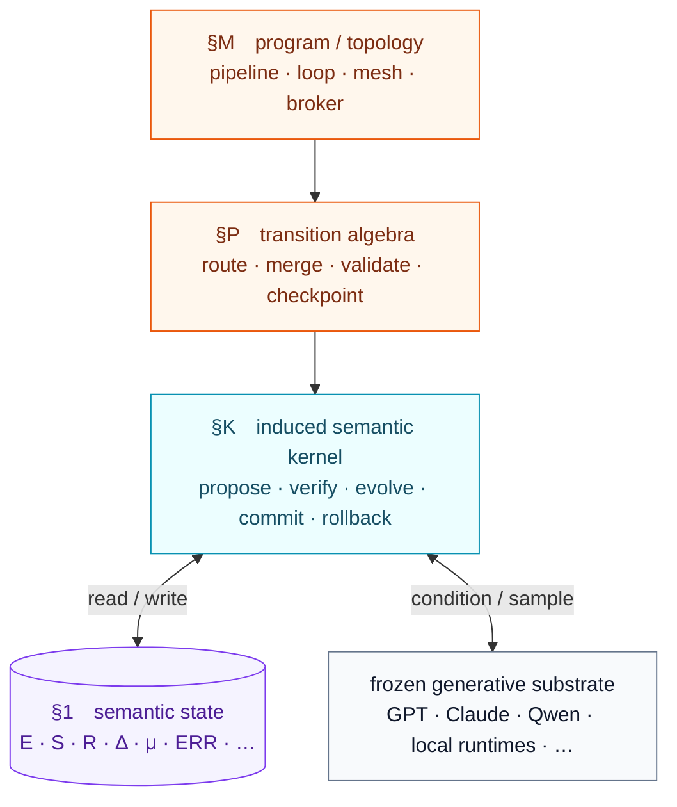
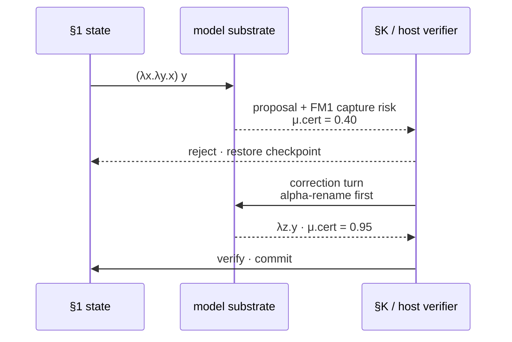
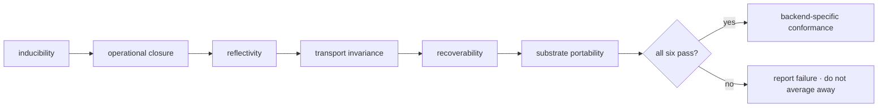

<p align="center">
  
</p>

<h1 align="center">trasgo §1</h1>

<p align="center">
  <strong>Induce a compact context language from finite examples — no weight updates.</strong>
</p>

<p align="center">
  <a href="#start--始">start</a>　·　
  <a href="#shape--形">shape</a>　·　
  <a href="#evidence--証">evidence</a>　·　
  <a href="#research--研">research</a>　·　
  <a href="docs/theory.md">theory</a>
</p>

<p align="center">
  
  
  
  
</p>

---

## 間 · the space between prompt and machine

<p align="center">
  
</p>

Trasgo is an experimental context codec and in-context reasoning protocol. It factors natural-language context into compact §1 JSON packets, then uses worked examples to help a capable LLM infer the packet grammar inside its existing context window—without fine-tuning or weight updates.

The repository contains the codec specification, a Node.js orchestration CLI, an optional Rust runtime, offline verification fixtures, demonstrations, and recorded model evaluations. The current boot seed has four examples; exemplar count is an implementation parameter, not a universal guarantee. Behavior depends on model, prompt, and task.

---

## The Key Result: Autonomous Self-Correction

The Trasgo protocol allows LLMs to detect their own reasoning failures by encoding uncertainty as a first-class signal. In the **V2 Capture-Avoidance Test**, the model reduces a Lambda calculus redex `(λx.λy.x) y`. A naive substitution would lead to variable capture (`λy.y`), but Trasgo's `μ.cert` axis forces the model to monitor structural integrity.

The interesting object is not generated text. It is a proposed state transition that can be checked, committed, rejected, or replayed.



> [!IMPORTANT]
> Trasgo is experimental. The repository contains a working codec/orchestration CLI, recorded evaluations, and a deterministic §K reference scaffold. The scaffold is not yet the execution path for every CLI command, and passing its tests does not establish LLM conformance.

---

## start · 始

### 01 — install

Requires Node.js 20 or newer. Rust is optional.

**Step 2.** The model reads the current finite boot exemplar set (four examples) and attempts to induce the grammar.

From a source checkout:

```bash
npm ci
npm test
npm run quickstart
```

### 02 — prompt only

1. Paste [`src/boot.md`](src/boot.md) into a capable instruction-following model.
2. Let the model infer the current four-example boot grammar.
3. Ask both calibration questions:

```text
Q_codec:   What changed for K and why?
Q_natural: What happened to cooling loop 7 and what's the safeguard strategy?
```

4. Compare the answers semantically. If they agree, send a §1 packet:

```json
{
  "§": 1,
  "E": {
    "N": ["edge-cluster-7", "compute-node"],
    "X": ["vision-service", "workload"]
  },
  "S": {
    "N.capacity": "12GPU",
    "N.domains": ["vision", "telemetry", "ops"]
  },
  "R": ["N→X:hosts"],
  "Δ": ["X.stage:staging→active@2026-01"],
  "μ": { "scope": "operations", "urg": 0.6, "cert": 0.85 }
}
```

The boot size is an implementation parameter, not a machine axiom. Calibration is a check for this context—not proof of general reliability.

---

## shape · 形

### four layers, one boundary



| layer | role | compact reading |
|---|---|---|
| **§1** | semantic state IR | entities, attributes, relations, deltas, control, error, evolved axes |
| **§P** | transition algebra | atomic context operations |
| **§M** | program topology | composition across pipelines, loops, routers, and agents |
| **§K** | research kernel | induced semantics plus proposal, verification, commit, and recovery |
| **model** | substrate | frozen generator conditioned by the bounded workspace |

The model proposes. The kernel decides what becomes operative state. See the [formal machine definition](docs/trasgo-machine.md), [preregistered experiment](docs/reflective-machine-preregistration.md), and [implementation roadmap](docs/reflective-machine-roadmap.md).

### state is not a flat point

Trasgo's research architecture distinguishes programs from the induced kernel that executes them. The LLM is the generative substrate; §K is the proposed machine boundary.

```
┌─────────────────────────────────────────────────────────┐
│                  §M PROGRAM / TOPOLOGY                   │
│        pipeline · router · agent · mesh · loop           │
│                                                          │
│                 §P TRANSITION ALGEBRA                    │
│ route · compress · merge · validate · checkpoint · ...   │
│                                                          │
├─────────────────────────────────────────────────────────┤
│                  §1 SEMANTIC STATE IR                    │
│                                                          │
│       E · S · R · Δ · μ · ERR · evolved axes            │
│                                                          │
├─────────────────────────────────────────────────────────┤
│                §K INDUCED SEMANTIC KERNEL                │
│                                                          │
│    Σ · propose · verify · evolve · commit · rollback     │
├─────────────────────────────────────────────────────────┤
│             FROZEN GENERATIVE SUBSTRATE                  │
└─────────────────────────────────────────────────────────┘
```

### The LLM is the substrate. §K is the research machine.

Unlike traditional frameworks, Trasgo uses in-context examples to elicit codec operations from the model and validates the resulting transition proposals.
- **§1 Codec:** Compact dimensional factoring of relational context. Losslessness is task- and packet-dependent and should be checked with round-trip evaluation.
- **§P Protocol:** Atomic operations (opcodes) for context manipulation.
- **§M Machines:** Composable topologies (VM configurations) for multi-agent orchestration.

The full definition, falsifiable conformance properties, and claim boundaries are in [`docs/trasgo-machine.md`](docs/trasgo-machine.md). The decisive cross-backend experiment is specified in the [`preregistration`](docs/reflective-machine-preregistration.md), with staged engineering work in the [`implementation roadmap`](docs/reflective-machine-roadmap.md).

---

## correction · 直

Uncertainty is state, not decoration. A low `μ.cert` or explicit error can trigger validation, checkpoint recovery, and a corrected retry.



The recorded V2 fixture follows this trajectory. It is bounded evidence that the tested model followed the protocol—not proof of general self-verification.

---

## operate · 動

The CLI manages local session state, packs, runtime discovery, verification, and optional native execution.

```bash
trasgo init "portfolio runtime"
trasgo pack --out .trasgo-runtime/packs/portfolio.json
trasgo boot --from .trasgo-runtime/packs/portfolio.json
trasgo send "What changed for K and why?"
trasgo verify --all
trasgo status
```

Optional native build:

```bash
cargo build --manifest-path rust/trasgo/Cargo.toml --release
```

<p align="center">
  
</p>

---

## evidence · 証

### claim map

| surface | status | what can be claimed now |
|---|---|---|
| §1 codec + CLI | implemented | runnable locally through the documented commands |
| deterministic §K scaffold | implemented | host-side contracts and structural predicates pass offline tests |
| recorded model probes | archived | bounded outcomes under their recorded prompts and endpoints |
| reflective-machine conformance | **not established** | requires all six preregistered properties on live substrates |
| cross-backend continuation | **not established** | remains part of the decisive experiment |

### recorded model evaluations

These are repository artifacts, not a current leaderboard. Model services, aliases, prompts, and provider behavior can drift.

| model | calibration | cross-domain | state | protocol | recorded classification |
|---|:---:|:---:|:---:|:---:|---|
| MedGemma 4B | ✗ | ✗ | ✓ | ✗ | failed |
| Qwen2.5-7B | ✗ | ✗ | ✗ | ✗ | failed |
| MedGemma 27B | 3/4 | partial | ✓ | partial | partial |
| rnj-1-instruct | 3/4 | 3/3 | 10/10 | 1/4 | §1-advanced |
| DeepSeek-V3 | 3/4 | 3/3 | 4/4 | 1/3 | §1-advanced |
| GPT-4o | 3/3 | 3/3 | ✓ | ✓ | §1-advanced |
| Claude Opus | 3/3 | 3/3 | ✓ | ✓ | §1-advanced |

The formal-reasoning archive contains recorded passes for lambda reduction, correction, protocol evolution, Church arithmetic, and a bounded recursive-factorial trace. None implies Turing completeness or general formal correctness. Inspect [`src/tests/`](src/tests/) and [`docs/foundations.md`](docs/foundations.md) before comparing systems or citing results.

### reproduce the deterministic layer

```bash
npm run test:machine      # six host-contract surfaces
npm run bench:machine     # 32 → 4,096 vertex structural benchmark
npm run verify            # repository verification report
```

The benchmark uses correctness controls before timing and emits machine-readable JSON. Latency numbers are host-specific; no universal performance threshold is claimed.

---

## research · 研

The target is a **Trasgo Reflective Machine**: a bounded, stochastic, self-extensible abstract machine instantiated on a frozen generative model, with operational semantics induced from examples in working context.

Conformance is conjunctive:



No weighted composite can hide a failed property. The empirical experiment has not yet been run; deterministic scaffold results must not be reported as model results.

### reading path

1. [`docs/trasgo-machine.md`](docs/trasgo-machine.md) — formal object and claim boundary
2. [`docs/reflective-machine-preregistration.md`](docs/reflective-machine-preregistration.md) — decisive experiment
3. [`docs/reflective-machine-roadmap.md`](docs/reflective-machine-roadmap.md) — staged implementation
4. [`docs/theory.md`](docs/theory.md) — bundle/transport intuition
5. [`docs/isa-mapping.md`](docs/isa-mapping.md) — systems analogy

---

## principles · 原

```text
examples over hidden magic
proposals over automatic mutation
predicates over vibes
rollback over rationalization
evidence over mythology
```

---

## license

MIT © Jesús Vilela Jato, 2026
